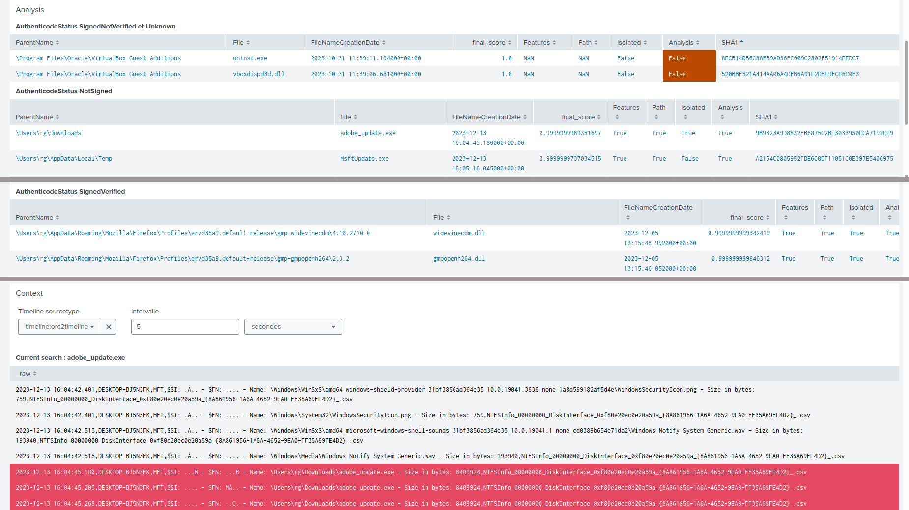

- [DECODE](#decode)
  - [Data acquisition and cleaning](#data-acquisition-and-cleaning)
  - [Detection methods](#detection-methods)
    - [Structural outlier detection](#structural-outlier-detection)
    - [Metadata analysis by AuthenticodeStatus group](#metadata-analysis-by-authenticodestatus-group)
      - [Path analysis](#path-analysis)
      - [Feature analysis](#feature-analysis)
  - [Results interpretation and visualization](#results-interpretation-and-visualization)
    - [Interpreting the results](#interpreting-the-results)
    - [Visualization modules](#visualization-modules)
      - [Tree structure visualization](#tree-structure-visualization)
      - [Splunk dashboard](#splunk-dashboard)


# DECODE

**DECODE**, or "**DE**tection de **CO**mpromissions dans les **D**onné**E**s DFIR-ORC" in French, is a stand-alone tool specifically designed for detecting anomalous Portable Executable (PE) files among the NTFSInfo data collected by DFIR-ORC on Microsoft Windows system.

This tool ranks PE files found on a machine from most to least anomalous, allowing forensic analysts to prioritize their efforts during incident response or compromise assessment.

Anomaly scores are computed using both traditional outlier detection algorithms and graph-based anomaly detection. Our approach only leverages file metadata, avoiding in-depth analysis of the binary content of the PEs. In addition, it does not rely on pre-trained machine learning models and adapts easily to new systems and attacks.

Several detection methods are used to find:
  * isolated files in the tree structure
  * files with abnormal metadata.

DECODE was developed to analyze NTFSInfo data collected by DFIR-ORC, a forensic tool developed by ANSSI that you can find [here](https://github.com/DFIR-ORC/dfir-orc).

To start the analysis:


```bash
machine_analysis NTFSInfo_FILE --csv_output Results_data.csv --pdf_output file_tree.pdf
```

* NTFSInfo_FILE: NTFSInfo file collected by DFIR-ORC in csv format;
* --csv_output (str): path to the results output (*Results_data.csv* by default). The output is a CSV document;

Optional parameters:

  * --version: show program's version number and exit;

  * --log-level (level): print log messages of this level and higher, possible choices: CRITICAL, ERROR, WARNING, INFO, DEBUG;

  * --log-file file: log file to store DEBUG level messages;

  * --pdf_output (str): path to the visualization output (*file_tree.pdf* by default). The output is a PDF document containing a tree-based visual display of the results;

  * --dlls_file (str): ListDLLs file in txt format from DFIR-ORC;
    * ListDLLs file can be generated by DFIR-ORC (archive [General](https://github.com/DFIR-ORC/dfir-orc-config/blob/master/config/DFIR-ORC_config.xml#L153), keyword [Listdll](https://github.com/DFIR-ORC/dfir-orc-config/blob/master/config/DFIR-ORC_config.xml#L196)), by using [ListDLLs](https://learn.microsoft.com/fr-fr/sysinternals/downloads/listdlls) Sysinternals tools;

  * --start_date/--end_date: customization of the time window in "Y-m-d" format. If the dates are not specified, the function analyzes the last time_windows months of the machine by default;

  * --time_window (int): time window (in months) to consider during the analysis. By default it is set to 6, which represents the 6 months preceding the latest date identified in the MFT.


Other parameters that can be configured in the src/decode/config.py file:

  * CONTAMINATION (float): proportion of outliers (0.02 by default). The top-n files in the anomaly ranking are flagged as outliers, where n equals contamination * (total number of files);

  * MIN_FILE (int): minimum number of files required to start the analysis, by default set to 10. If the number of files is lower, the algorithms are not launched and all the files are reported with the maximum abnormality score of 1;

  * EXCLUDED_FILES ({attribut: value}): to exclude files from analysis (such as DFIR-ORC files for example).


## Data acquisition and cleaning

Among the NTFSInfo data, DECODE only analyzes PEs. It is therefore necessary to filter and clean the data beforehand.

__Data filtering__

We only keep files that are still present on the disk, with an AuthenticodeStatus and we remove possible duplicate information for the same file.  
The analysis is launched on files whose creation date belongs to the time window. The window is configured by default for the last 6 months but it can be modified with the optional parameters --start_date and --end_date for specific dates. The creation date is determined by the `FileNameCreationDate` timestamp.

In short we keep the following files:
  * the `FileNameCreationDate` timestamp belongs to the analysis time window;
  * the file was not deleted: `RecordInUse` == 'Y';
  * the file has an AuthenticodeStatus:`AuthenticodeStatus` != "";
  * the file name is not in DOS format (helps avoid duplicates): `FilenameFlags` != 2.

We also filter columns not relevant to the analysis.

__Data enrichment__

New attributes are calculated: `PathDepth`, `FilesCreatedAtSameTime` and `WarningInListDLLs` (if the ListDlls file is passed in the parameters).
  * `PathDepth` path depth between root and parent directory;
  * `FilesCreatedAtSameTime` corresponds to the number of PEs created at the same time (+/-1 min) as this file, based on `FileNameCreationDate` timestamp;
  * `WarningInListDLLs` True if a warning is present in the ListDlls file, False otherwise.

## Detection methods

Several detection methods are used to find:
* isolated files in the tree structure of the whole file system (structural outliers)
* files with abnormal metadata depending on the AuthenticodeStatus class.

The analysis assigns an anomaly score to each file which allows them to be classified to prioritize investigations.  
Intermediate scores are defined as *p*-values. The lower this value, the more abnormal the file.

### Structural outlier detection

This method uses graph-based anomaly detection to detect files that are located in low-density regions of the file tree. The method takes into account all PEs, regardless of their Authenticode Status.

The isolation score of a file is defined as the product of the number of children of each of its parent directories. The score is returned by the *p*-value `isolated_pval`.


### Metadata analysis by AuthenticodeStatus group

Metadata analysis includes two approaches. We analyze separately the __path__ and the attributes of the file which we call __features__ in the rest of the document.  

File metadata analysis compares each file with other members of its `AuthenticodeStatus` class. These classes are as follows:
* **SignedVerified**: file is signed and the signature verified
* **SignedNotVerified**: file signature does not verify
* **NotSigned**: no signature or catalog could be found for this file
* **Unknown**: status failed to be determined
* **CatalogSignedVerified**: file hash is listed in a catalog

Files with a **CatalogSignedVerified** AuthenticodeStatus are filtered out in this method. We do not analyze them as these files have a low probability of being malicious.

Files within classes **SignedNotVerified** and **Unknown** are considered abnormal and returned directly to the user with the maximum abnormality score of 1. These are uncommon classes and given the small proportion of files it is interesting to return them all.

We launch the metadata analysis on the **NotSigned** and **SignedVerified** classes if the number of files is greater than or equal to __MIN_FILE__ (minimum number of files). If there are not enough files, they are returned directly with the maximum abnormality score of 1.

#### Path analysis

The purpose of path analysis is to detect files that are isolated from other files of their class.
We use the structural_outliers function within the AuthenticodeStatus class. This makes it possible to detect for example a NotSigned file which would have been deposited in a common directory usually populated with CatalogSignedVerified files.  
The anomaly score is given by the *p*-value `path_pval`.

#### Feature analysis

Feature analysis makes it possible to detect whether the file differs from other files in its class due to its metadata.  
The metadata considered are as follows:
  * `Version` : boolean ;
  * `Platform` : categorical ;
  * `FileType` : boolean ;
  * `FileOS` : boolean ;
  * `PeSHA1` : boolean ;
  * `AuthenticodeStatus` : categorical ;
  * `AuthenticodeSignerThumbprint` : boolean ;
  * `AuthenticodeCAThumbprint` : boolean ;
  * `SignedHash` : boolean ;
  * `PathDepth` : integer (directory depth relative to root) ;
  * `FilesCreatedAtSameTime` : integer (number of files created +/- 1 minute from the file creation date);
  * `WarningInListDLLs`: boolean (if the ListDLLs file is passed).

To detect abnormal files we use two anomaly detection algorithms: **Isolation Forest** and **DBSCAN**.  

These two methods give to each file an abnormality score for the features
  * `if_features_pval` for Isolation Forest
  * `db_features_pval` for DBSCAN. The *p*-value is calculated from the results of the algorithm's decision `db_feature` (1 if it is an anomaly, 0 otherwise) and the distance to the nearest core point `features_core_pnt`. The greater this distance, the further the file is from a cluster.

A score for the features analysis `features_pval` is then calculated from the results of the two algorithms.

## Results interpretation and visualization

A final score is assigned to each file corresponding to the sum of the scores: `isolated_pval` + `features_pval` + `path_pval`. The higher the score, the more abnormal the file.  
The analysis result is returned in the csv file *Results_data.csv* in the current directory if it has not been defined by the --csv_output parameter.

Reminder: PE with a "CatalogSignedVerified" AuthenticodeStatus are not returned, we do not analyze them as these files have a low probability of being malicious.

### Interpreting the results

Below are the details of the different attributes added by the analysis:

| Attribute          | Content     |
| -------------------| ------------|
| `Analysis`         | boolean set to True if the analysis has been launched, False otherwise (insufficient number of files, AuthenticodeStatus class SignedNotVerified or Unknown)|
| `isolated_pval`    | *p*-value, corresponds to the isolation score of the file|
| `Isolated`         | boolean set to 1 if the file was detected as an isolated file on the machine by the structural_outliers function, 0 otherwise|
| `path_pval`        | *p*-value corresponds to the isolation of the file in relation to other files of its AuthenticodeStatus class|
| `Path`             | boolean set to 1 if the file was detected as an anomaly by path analysis, 0 otherwise|
| `if_features_pval` | *p*-value, corresponds to the Isolation Forest score|
| `db_features`      | boolean set to 1 if the file was detected as an anomaly by DBSCAN, 0 otherwise|
| `features_core_pnt`| distance to the nearest core point|
| `db_features_pval` | *p*-value, corresponds to the DBSCAN score: `db_features` + `features_core_pnt`|
| `features_pval`    | *p*-value, corresponds to the feature analysis score: `if_features_pval` + `db_features_pval`|
| `Features`         | boolean set to 1 if the file was detected as an anomaly by feature analysis, 0 otherwise|
| `WarningInListDLLs`| boolean set to 1 if a warning is present in the ListDlls file |
| `final_score`      | final score of the file corresponding to the sum of the three methods: `isolated_pval` + `features_pval` + `path_pval`. The higher the score, the more abnormal the file.|

### Visualization modules

#### Tree structure visualization

A simplified file tree is generated during the analysis for visualization purposes.  
In this tree structure  the files are grouped into clusters (represented by the blue rectangles in the graph). Outliers are displayed in red.
If the file is represented in a cluster comprising several directories (named * in the tree) then the relative path is given with the file name.  
We set the maximum number of abnormal files displayed in the tree to 60 to minimize clutter and preserve clarity.

The detection method(s) are indicated before the file name:
* I : detected by the structural outliers method;
* F : detected by the features analysis;
* P : detected by the path analysis;
* X : reported directly as abnormal (insufficient number of files, AuthenticodeStatus class SignedNotVerified or Unknown).

The tree structure view be saved in pdf format in the file *file_tree.pdf* in the current directory or specified with the --pdf_ouput parameter.

#### Splunk dashboard

A splunk dashboard provides an interface for analyzing the results.  
The results are grouped according to their AuthenticodeStatus class and sort by abnormality.  

<center>

</center>

It is possible to correlate DECODE results with a timeline. If a timeline is imported, selecting a file displays the timeline around each occurrence of the file.

<center>

</center>
